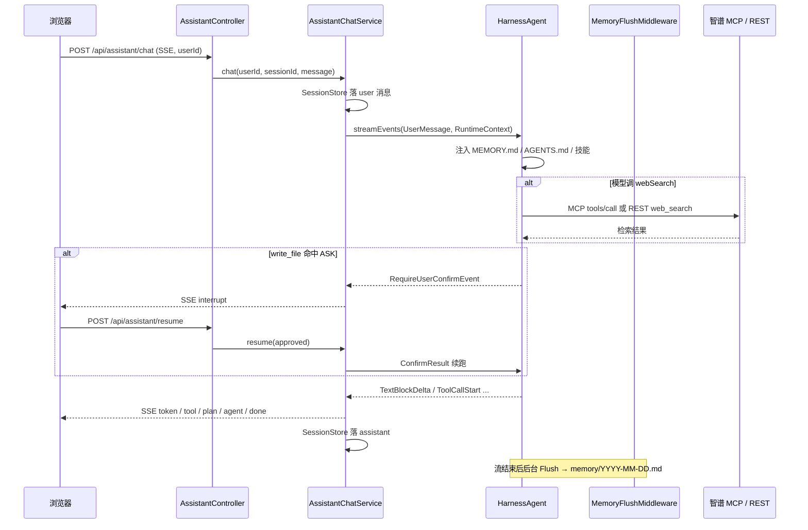

# 小深：用 AgentScope Java 2.0 Harness 做私人助手（上）

> 本篇是系列 **上篇**：为什么用官方 Harness、六层架构、装配层、Redis、记忆与多用户隔离。  
> 下篇：[小深-AgentScope-Java-2.0-Harness架构博客-02.md](./小深-AgentScope-Java-2.0-Harness架构博客-02.md)（工具、MCP/REST、SSE、前端、踩坑笔记）  
> 项目：`agentscope-assistant-java` · 技术栈：**Spring Boot 3.2.5 + AgentScope Java 2.0.1 `HarnessAgent` + MCP SDK 0.17.0**
>
> **相对早期草稿的变更（请以本节为准）：** 已去掉单机 JSON / `distributed` profile；生产只连 Redis。网页会话、AgentState、工作区文件、写文件审批都在 Redis。自定义深色 UI（不用官方 AG-UI）。日志 `%X{SESSION_ID}` 不打印 userId。集成测试只 FLUSHDB **db=15**。

## 0. 写在前面

如果你做过 LLM Agent，大概经历过这些坑：

- 长任务中途「忘了自己在干什么」
- 调研过程把统筹上下文撑爆
- 自己写一套记忆抽取，和框架后台 Consolidation 抢 `MEMORY.md`
- 多副本部署后，工作区文件和对话状态各活各的
- MCP SDK 和 json-schema-validator 版本一拧，启动直接 `NoClassDefFoundError`

**AgentScope Java 2.0** 的答案同样不是「再换一个更强的模型」，而是用官方 **HarnessAgent**：规划、文件系统、子 Agent、HITL、分层记忆、压缩、技能，都已经在框架里。应用层要做的是 **接线**，而不是再造一套中间件。

| 能力 | 作用 | 本项目怎么打开 |
|------|------|----------------|
| 规划（todos / Plan Mode） | 多步任务显式化；复杂事先写方案 | `TodoTools` + `enablePlanMode()` |
| 文件系统（带隔离） | 中间产物进 Redis 工作区；按用户分命名空间 | `RemoteFilesystemSpec.isolationScope(USER)` |
| 子 Agent | 专科活隔离上下文 | 不 disable；`workspace/subagents/` + `agent_spawn` |
| 人工审批（HITL） | 写文件中断，等人批准后再续跑 | `PermissionBehavior.ASK` + Redis `as:pending:` + `/api/assistant/resume` |
| 分层记忆 | 日流水 Flush + 长期 Consolidation | `.memory(MemoryConfig)`，不要自己抽 JSON |
| 上下文压缩 | 超长摘要前缀，原文卸到 jsonl | `.compaction(...)` + `session_search` |
| 技能 | 目录渐进加载；可自进化 | `enableSkillManageTool` + `enableSkillCurator` |
| 会话恢复 | 任意副本用 (userId, sessionId) 续跑 | 唯一后端：`RedisAgentStateStore` |
| 多用户 | 记忆 / 工作区 / 网页会话互不可见 | `RuntimeContext.userId` + `IsolationScope.USER` |
| 多副本 | 状态、工作区、网页会话、审批单共享 | 默认 Redis，**没有** `distributed` profile |

本项目是这套思想的 **Spring 接线示例**：统筹助手「小深」+ 联网调研工具 + 官方 research/general-purpose 子 Agent，前端通过 SSE 看工具轨迹并处理审批卡片。

和 `deepagents-assistant-java` 的差别一句话：**那边用 LangGraph4j 自己实现 Harness；这边把同类产品能力接到 AgentScope 官方 API 上。**

---

## 1. 系统架构

### 1.1 六层结构

```
┌─────────────────────────────────────────────────────────────────┐
│  L6  产品层                                                      │
│      AssistantController（SSE /chat + /resume，全部带 userId）     │
│      AssistantChatService（RuntimeContext + Redis pending）        │
│      AgentEventMapper（官方 AgentEvent → token/tool/interrupt）    │
│      SessionStore（网页聊天 JSON，Redis as:web: / as:web-index:）   │
├─────────────────────────────────────────────────────────────────┤
│  L5  生产存储（只有 Redis，无单机 JSON）                           │
│      RedisAgentStateStore + RedisBaseStore + RedisPendingApproval  │
│      RemoteFilesystemSpec + DistributedStore                       │
│      ConversationMdc / SessionMdcInterceptor（日志 SESSION_ID）    │
├─────────────────────────────────────────────────────────────────┤
│  L4  统筹 HarnessAgent                                           │
│      ModelRegistry.resolve("openai:"+model) 流式                  │
│      maxIters=80 · PermissionMode.BYPASS + write_file ASK         │
│      MemoryConfig（Flush / Consolidation）                        │
│      CompactionConfig + ToolResultEviction + Plan Mode + Skills    │
├─────────────────────────────────────────────────────────────────┤
│  L3  工具                                                         │
│      官方：todo_write、filesystem、agent_spawn、memory_*、          │
│            session_search、skill_manage                           │
│      本项目：webSearch/webRead、calculate、getCurrentDateTime、     │
│            search_conversation_history                            │
├─────────────────────────────────────────────────────────────────┤
│  L2  子 Agent（框架内置 + 工作区 agents/）                         │
│      research-agent / general-purpose · 提示词在 workspace/        │
├─────────────────────────────────────────────────────────────────┤
│  L1  外部世界                                                     │
│      OpenAI 兼容大模型 · 智谱 MCP 0.17 · 必连 Redis（ping 失败不起）│
└─────────────────────────────────────────────────────────────────┘
```

### 1.2 一次用户消息怎么走



### 1.3 与官方 Harness / 原 Java 项目的对应

| 概念 | AgentScope 官方 | 本项目 | 原 `deepagents-assistant-java` |
|------|-----------------|--------|-------------------------------|
| 工厂 | `HarnessAgent.builder()` | `AgentScopeConfig` | `CreateDeepAgent.create` |
| 运行时 | Harness ReAct 循环 | 同一个 `HarnessAgent` | LangGraph4j `AgentExecutorEx` |
| 记忆 | Flush + Consolidation | `.memory(MemoryConfig)` | 自研 `MemoryStore` + `update_memory` |
| 文件 | `FilesystemSpec` | 仅 `RemoteFilesystemSpec` + 隔离 USER | `WorkspaceFileOperations` |
| 子 Agent | `agent_spawn` | 不 disable | `task` / `task_batch` |
| HITL | Permission ASK | `approval-tools` + Redis pending | `approvalOn(...)` |
| 压缩 | `CompactionConfig` | 显式打开 | `SummarizingConversationContextPolicy` |
| 状态 | `AgentStateStore` | 仅 Redis | `FileSystemSaver` checkpoint |
| 联网 | MCP Client | SDK **0.17.0** + REST 回退 | MCP 0.14.1 路径 |

### 1.4 角色分工

| 角色 | 职责 | 典型工具 |
|------|------|----------|
| **统筹（小深）** | 理解目标、规划、委派、对用户答复 | todos、files、agent_spawn、memory_*、时间/计算、网页检索 |
| **research-agent** | 多角度联网调研 | 工作区 `subagents/research-agent.md`；主工具仍是 webSearch/webRead |
| **网页用户** | 看自己的会话和档案 | `/api/history/search`、`/api/memory`，与官方 jsonl 不是同一份 |

两份「历史」不要混：

| 数据 | 路径 | 谁写 | 谁读 |
|------|------|------|------|
| 网页聊天 JSON | Redis `as:web:{userId}:{sessionId}` | `SessionStore` | 侧栏、`search_conversation_history` |
| 压缩卸载日志 | Redis 工作区 `sessions/*.log.jsonl` | 官方 Compaction | 官方 `session_search` |
| 日流水 | Redis 工作区 `memory/YYYY-MM-DD.md` | 官方 Flush | 官方 `memory_search`、档案页 |
| 长期记忆 | Redis 工作区 `MEMORY.md` | 官方 Consolidator | 每轮注入 prompt、档案页 |

### 1.5 关键运行配置

- 端口：`8089`
- 模型：OpenAI 兼容（`llm.*`，示例 `qwen3.8-27b` / 百炼 MaaS）
- **思考模式**：`llm.enable-thinking: false`（Qwen 思考 + 流式时 tool_calls 容易不稳）
- 联网：默认 MCP（`mcp.zhipu.enabled=true`），SDK **必须 0.17.0+** 才能和 agentscope 的 `json-schema-validator:2.0.0` 共存
- 迭代：`agent.max-iters=80`
- 审批：`write_file` / `edit_file`
- 工作区种子：`workspace/`（`AGENTS.md`、skills、subagents）。运行时 MEMORY.md / 日流水 / jsonl 在 Redis
- Redis：默认 `127.0.0.1:6379` db=0，**启动必 ping**；不需要 `distributed` profile
- 日志：`logback.xml` 打印 `%X{SESSION_ID}`，**不打印 userId**（避免泄露用户信息）

`${user.dir}` 是 **JVM 工作目录**（IDEA 跑该模块时一般是 `agentscope-assistant-java/`）：

| 配置 / 存储 | 位置 | 用途 |
|------|------|------|
| `agent.workspace` | `workspace/` | 种子：AGENTS.md、skills、subagents、PREFERENCES.md |
| Redis `as:state:` / `as:list:` | AgentState | 对话上下文、权限、计划；框架 `streamEvents` 自动 load/save |
| Redis `as:base:` | RemoteFilesystem | MEMORY.md、日流水、压缩卸载 jsonl |
| Redis `as:web:` / `as:web-index:` | 网页会话 | 侧栏列表与聊天全文 |
| Redis `as:pending:` | HITL | 写文件审批单，TTL 1 小时 |

### 1.6 多用户与 HITL（必读）

**（1）隔离靠二元组，不是靠「别传错 sessionId」**

所有寻址都是 `(userId, sessionId)`：

- HTTP：POST body.`userId`；GET/DELETE 用 `X-User-Id` 或 `?userId=`
- 空白 userId → `"local"`（兼容原来的单用户）
- `UserIds` / `SessionIds` 挡住 `../`、`/`、空字节（会拼进 Redis key）
- Harness：`RuntimeContext.userId` + `IsolationScope.USER`，MEMORY.md 按用户分命名空间
- HITL：`as:pending:{userId}:{sessionId}`，避免审批打到另一副本丢单

**（2）写文件会停，必须 resume**

权限默认 `BYPASS`，只给 `write_file` / `edit_file` 加 ASK。框架抛 `RequireUserConfirmEvent` → SSE `interrupt` → 前端点批准/拒绝 → `ConfirmResult` 续跑同一条统筹图。

**（3）不要自己再抽一轮记忆**

流结束后 `MemoryFlushMiddleware` 已经在后台写日流水。本项目的 `HarnessMemoryCatalog` **只读**。若再调模型覆盖 `MEMORY.md`，会和 `MemoryConsolidator` 打架。

### 1.7 用本文源码复现项目

仓库里的 **主代码 + 测试 + 工作区模板 + `pom.xml` + `application.yml` + `index.html` + `.gitignore`** 下文均有对应内容（测试与工作区模板在下篇）；Java 已**省略 `import`**。

1. 准备 **JDK 17** 与 **Maven 3.8+**。
2. 建目录 `agentscope-assistant-java/`，把每个 `### \`path\`` 下的代码块存成该相对路径。
3. 只改配置里的密钥与模型接入点（本文已脱敏，**不能直接拿占位符去调模型**）：
   - `llm.base-url` / `llm.model`
   - `export LLM_API_KEY=...`（或写在 yml）
   - 智谱搜索：`export MCP_API_KEY=...`，保持 MCP **0.17.0**
   - Redis：先 `redis-server`（默认 db=0）。**不要**再加 `distributed` profile
4. `mvn spring-boot:run`，打开 http://localhost:8089 ，侧栏填「用户」。Redis ping 失败进程不会起来。

`workspace/` 启动时会建种子子目录。对话 / 记忆 / 网页会话都在 Redis，重启 Java **不会**丢；`FLUSHDB` db=0 或 Redis 无持久化重启才会丢。集成测试只清 **db=15**。免费额度耗尽时百炼会 403 `insufficient_quota`，与框架无关。

---

## 2. 模块详解与源码

下面按「阅读顺序」展开每个模块：**先说明职责，再贴核心源码**（Java 已省略 `import`，与仓库逻辑一致；配置中的密钥已脱敏）。

## 一、项目入口与总览

### `src/main/java/cn/deepassistant/DeepAssistantApplication.java`

**作用：** Spring Boot 启动入口。官方 Harness 能力都在 AgentScopeConfig 打开

```java
package cn.deepassistant;

/**
 * Spring Boot 入口。所有 AgentScope 官方能力都在 {@link cn.deepassistant.config.AgentScopeConfig} 里打开。
 */
@SpringBootApplication
public class DeepAssistantApplication {

    public static void main(String[] args) {
        SpringApplication.run(DeepAssistantApplication.class, args);
    }
}
```

## 二、Harness 装配层

### `src/main/java/cn/deepassistant/config/AgentScopeConfig.java`

**作用：** 唯一装配入口。生产只走 Redis：模型、RemoteFilesystem、DistributedStore、分层记忆、压缩、Plan Mode、技能、写文件 ASK。启动 ping Redis，失败进程退出。已删除 `DistributedAgentScopeConfig` 与 `JsonFileAgentStateStore`。

```java
package cn.deepassistant.config;

/**
 * 把 AgentScope Java 2.0 Harness 接到 Spring。生产只走 Redis：
 * AgentState、工作区文件都进 {@link RemoteFilesystemSpec} + {@link DistributedStore}。
 *
 * <p>对照官方文档（<a href="https://java.agentscope.io/v2/zh/docs/harness/memory.html">记忆</a>），
 * 不要再自己写一套「对话结束调模型抽 JSON」——框架已经有完整管线。
 *
 * <h2>官方核心能力在本 Bean 里怎么打开</h2>
 * <ol>
 *   <li><b>分层记忆</b>：{@link #memoryConfig()}。每次对话结束后后台 Flush 到
 *       {@code memory/YYYY-MM-DD.md}，再周期性 Consolidation 进 {@code MEMORY.md}。</li>
 *   <li><b>上下文压缩</b>：{@code compaction(...)}。消息太多时摘要前缀；压缩前会再 flush 一次。</li>
 *   <li><b>大工具结果卸载</b>：{@code toolResultEviction}。单次工具输出太长时落盘，上下文只留预览。</li>
 *   <li><b>Plan Mode</b>：{@code enablePlanMode()}。只读规划，方案写到 {@code workspace/plans/}。</li>
 *   <li><b>技能仓库 / 自进化</b>：{@code enableSkillManageTool} + {@code enableSkillCurator}。</li>
 *   <li><b>子 Agent</b>：不 disable，工作区 {@code agents/} + {@code agent_spawn}。</li>
 *   <li><b>会话恢复</b>：Redis {@code AgentStateStore}，任意副本都能用 (userId, sessionId) 续跑。</li>
 *   <li><b>多用户隔离</b>：{@code IsolationScope.USER}。</li>
 *   <li><b>权限三态</b>：写文件 ASK，其余 BYPASS。</li>
 * </ol>
 *
 * <p>刻意<b>不要</b>调用 {@code disableMemoryHooks()} / {@code disableMemoryTools()}。
 */
@Slf4j
@Configuration
public class AgentScopeConfig {

    @Value("${llm.api-key}")
    private String apiKey;
    @Value("${llm.base-url}")
    private String baseUrl;
    @Value("${llm.model}")
    private String modelName;
    @Value("${llm.temperature:0.3}")
    private double temperature;
    @Value("${llm.enable-thinking:false}")
    private boolean enableThinking;
    @Value("${agent.workspace}")
    private String workspace;
    @Value("${agent.max-iters:80}")
    private int maxIters;
    @Value("#{'${agent.approval-tools:write_file,edit_file}'.split(',')}")
    private List<String> approvalTools;

    @Value("${agent.memory.flush-throttle-minutes:0}")
    private int flushThrottleMinutes;
    @Value("${agent.memory.consolidation-min-gap-minutes:30}")
    private int consolidationMinGapMinutes;
    @Value("${agent.memory.daily-retention-days:90}")
    private int dailyRetentionDays;

    @Value("${redis.host:127.0.0.1}")
    private String redisHost;
    @Value("${redis.port:6379}")
    private int redisPort;
    @Value("${redis.password:}")
    private String redisPassword;
    @Value("${redis.database:0}")
    private int redisDatabase;

    /**
     * 通过 AgentScope {@link ModelRegistry} 解析 OpenAI 兼容接口。
     * {@code parallelToolCalls=false}：一次只出一个工具调用，HITL 审批才不会叠多张单。
     * {@code stream=true}：事件流才能一 token 一 token 推到网页。
     *
     * <p><b>何时调用：</b>Spring 启动建 Bean。之后每轮 {@code streamEvents} 里框架拿这个
     * {@link Model} 去打大模型 API，本项目不再直接调它。
     */
    @Bean
    public Model chatModel() {
        if (apiKey == null || apiKey.isBlank()) {
            throw new IllegalStateException("未配置 llm.api-key / LLM_API_KEY");
        }
        GenerateOptions options = GenerateOptions.builder()
                .temperature(temperature)
                .parallelToolCalls(false)
                .additionalBodyParam("enable_thinking", enableThinking)
                .build();
        ModelCreationContext context = ModelCreationContext.builder()
                .apiKey(apiKey)
                .baseUrl(baseUrl)
                .stream(true)
                .enableThinking(enableThinking)
                .component(GenerateOptions.class, options)
                .build();
        return ModelRegistry.resolve("openai:" + modelName, context);
    }

    /**
     * 官方两层记忆的开关。自定义 consolidation prompt 必须恰好两个 {@code %d}，
     * 所以只在官方默认模板后面追加中文说明。
     *
     * <p><b>何时调用：</b>Spring 启动。真正 Flush 发生在每轮 {@code streamEvents} 结束后的
     * {@code MemoryFlushMiddleware}；Consolidation 由框架按 {@code consolidationMinGap} 周期性触发。
     */
    @Bean
    public MemoryConfig memoryConfig() {
        MemoryConfig.FlushTrigger trigger = flushThrottleMinutes <= 0
                ? MemoryConfig.FlushTrigger.always()
                : MemoryConfig.FlushTrigger.throttled(Duration.ofMinutes(flushThrottleMinutes));
        return MemoryConfig.builder()
                .flushTrigger(trigger)
                .flushPrompt(MemoryFlushManager.DEFAULT_FLUSH_PROMPT + """

                        Additional project rules:
                        - Write every extracted bullet in Chinese.
                        - Prefer durable user preferences, project facts, and constraints.
                        - Never record API keys, passwords, or .env contents.
                        """)
                .consolidationPrompt(MemoryConsolidator.DEFAULT_CONSOLIDATION_PROMPT
                        + "\nWrite the complete MEMORY.md in Chinese markdown.\n")
                .consolidationMinGap(Duration.ofMinutes(Math.max(1, consolidationMinGapMinutes)))
                .dailyFileRetentionDays(Math.max(7, dailyRetentionDays))
                .sessionRetentionDays(180)
                .build();
    }

    /**
     * Lettuce 客户端。密码空则不带 AUTH。容器销毁时 {@code shutdown}，避免连接泄漏。
     *
     * <p><b>何时调用：</b>Spring 启动；之后所有 Redis 操作共用这一条 client。
     */
    @Bean(destroyMethod = "shutdown")
    public RedisClient redisClient() {
        RedisURI.Builder uri = RedisURI.builder()
                .withHost(redisHost)
                .withPort(redisPort)
                .withDatabase(redisDatabase);
        if (redisPassword != null && !redisPassword.isBlank()) {
            uri.withPassword(redisPassword.toCharArray());
        }
        return RedisClient.create(uri.build());
    }

    /**
     * 同步连接并 PING。连不上直接 fail-fast，避免进程起来后第一条聊天才发现 Redis 挂了。
     */
    @Bean(destroyMethod = "close")
    public StatefulRedisConnection<String, String> redisConnection(RedisClient redisClient) {
        StatefulRedisConnection<String, String> conn = redisClient.connect();
        String pong = conn.sync().ping();
        if (pong == null || !"PONG".equalsIgnoreCase(pong)) {
            conn.close();
            throw new IllegalStateException("Redis 不可用: " + redisHost + ":" + redisPort
                    + " db=" + redisDatabase + " ping=" + pong);
        }
        log.info("[Redis] 已连接 {}:{} db={}", redisHost, redisPort, redisDatabase);
        return conn;
    }

    /** 同步命令接口，SessionStore / AgentState / BaseStore / Pending 共用这一条连接。 */
    @Bean
    public RedisCommands<String, String> redisCommands(StatefulRedisConnection<String, String> conn) {
        return conn.sync();
    }

    /** Harness 对话上下文（messages、权限、计划）的 Redis 实现。 */
    @Bean
    public RedisAgentStateStore redisAgentStateStore(RedisCommands<String, String> redis) {
        return new RedisAgentStateStore(redis);
    }

    /** RemoteFilesystem 的 KV 后端：MEMORY.md、日流水、压缩卸载 jsonl。 */
    @Bean
    public RedisBaseStore redisBaseStore(RedisCommands<String, String> redis) {
        return new RedisBaseStore(redis);
    }

    /**
     * 官方分布式门面：同时塞 AgentState + BaseStore。
     * RemoteFilesystem 构建时会检查这个 Bean，缺一不可。
     */
    @Bean
    public DistributedStore distributedStore(RedisAgentStateStore stateStore,
                                             RedisBaseStore baseStore) {
        return DistributedStore.builder()
                .agentStateStore(stateStore)
                .baseStore(baseStore)
                .build();
    }

    /**
     * 再暴露一遍 {@link AgentStateStore} 接口，给 {@code AssistantChatService} 按接口注入删会话。
     */
    @Bean
    public AgentStateStore agentStateStore(RedisAgentStateStore redisAgentStateStore) {
        return redisAgentStateStore;
    }

    /**
     * 工作区走 RemoteFilesystem（Redis），状态走 DistributedStore。
     * 官方要求 RemoteFilesystem 必须配分布式状态，否则 {@code build()} 抛 IllegalStateException。
     *
     * <p><b>何时调用：</b>Spring 启动 {@code build()} 一次。之后每次聊天
     * {@code AssistantChatService.streamEvents} 调 {@code harnessAgent.streamEvents}，
     * 框架内部才会去调 Redis store、Toolkit 里的 {@code @Tool}、Flush 中间件。
     */
    @Bean(destroyMethod = "close")
    public HarnessAgent harnessAgent(Model chatModel,
                                     DistributedStore distributedStore,
                                     MemoryConfig memoryConfig,
                                     CommonTools commonTools,
                                     WebResearchTools webResearchTools,
                                     HistoryMemoryTools historyMemoryTools) throws Exception {
        Path ws = resolveAndInitWorkspace();
        // 业务工具挂到同一 Toolkit；Harness 自带的 filesystem / memory / spawn 不在这里注册
        Toolkit toolkit = new Toolkit();
        toolkit.registerTool(new TodoTools());
        toolkit.registerTool(commonTools);
        toolkit.registerTool(webResearchTools);
        toolkit.registerTool(historyMemoryTools);

        // 默认 BYPASS：读文件、搜索、spawn 不弹窗。approval-tools（默认写/改文件）改成 ASK
        PermissionContextState.Builder perm = PermissionContextState.builder()
                .mode(PermissionMode.BYPASS);
        for (String toolName : approvalTools == null ? List.<String>of() : approvalTools) {
            if (toolName == null || toolName.isBlank()) {
                continue;
            }
            String name = toolName.trim();
            perm.addAskRule(name, new PermissionRule(name, null, PermissionBehavior.ASK, "policy"));
        }

        HarnessAgent agent = HarnessAgent.builder()
                .name("xiao-shen")
                .sysPrompt("你是私人智能助手「小深」。人格与行为细则见工作区 AGENTS.md。"
                        + "跨会话事实以 MEMORY.md 为准；需要原文时用 memory_search / session_search / search_conversation_history。")
                .model(chatModel)
                .workspace(ws)
                .filesystem(new RemoteFilesystemSpec().isolationScope(IsolationScope.USER))
                .distributedStore(distributedStore)
                .toolkit(toolkit)
                .additionalContextFile("PREFERENCES.md")
                .permissionContext(perm.build())
                .maxIters(Math.max(25, maxIters))
                .memory(memoryConfig)
                .compaction(CompactionConfig.builder()
                        .triggerMessages(30)
                        .keepMessages(10)
                        .flushBeforeCompact(true)
                        .offloadBeforeCompact(true)
                        .truncateArgs(CompactionConfig.TruncateArgsConfig.builder()
                                .maxArgLength(2000)
                                .truncationText("... [truncated] ...")
                                .build())
                        .build())
                .toolResultEviction(ToolResultEvictionConfig.defaults())
                .enablePlanMode()
                .enableSkillManageTool(SkillManageConfig.defaults())
                .enableSkillCurator(SkillCuratorConfig.defaults())
                // 生产环境不给模型开宿主机 shell，避免误执行
                .disableShellTool()
                .build();
        log.info("[Harness] workspace={} flushTrigger={} approvalTools={}",
                ws,
                memoryConfig.flushTrigger(),
                approvalTools == null ? List.of() : new ArrayList<>(approvalTools));
        return agent;
    }

    /**
     * 解析工作区根目录并建好约定子目录。
     * 运行时文件走 Redis，这里的目录主要给启动时加载种子：{@code AGENTS.md}、skills、subagents。
     *
     * <p><b>何时调用：</b>仅 {@link #harnessAgent} 构建时一次。之后 Harness 读种子文件用本地盘，
     * 用户 MEMORY.md / 日流水走 Redis {@link cn.deepassistant.redis.RedisBaseStore}。
     */
    Path resolveAndInitWorkspace() throws Exception {
        Path ws = Path.of(workspace).toAbsolutePath().normalize();
        Files.createDirectories(ws);
        Files.createDirectories(ws.resolve("memory"));
        Files.createDirectories(ws.resolve("skills"));
        Files.createDirectories(ws.resolve("agents"));
        Files.createDirectories(ws.resolve("plans"));
        Files.createDirectories(ws.resolve("knowledge"));
        Files.createDirectories(ws.resolve("sessions"));
        return ws;
    }
}
```

### `DistributedAgentScopeConfig.java`（已删除）

原先用 Spring profile `distributed` 分「单机 JSON / Redis」两套 Bean。现已并入上面的 `AgentScopeConfig`：**默认就是 Redis + RemoteFilesystem**，不需要 `--spring.profiles.active=distributed`。

---

## 三、分布式状态（Redis）

### `src/main/java/cn/deepassistant/redis/package-info.java`

**作用：** 为什么官方 RemoteFilesystem 必须配分布式 AgentState

```java
/**
 * Redis 生产存储：AgentState、工作区文件、网页会话、HITL 待审批都进同一套 Redis，多副本共享。
 * 没有单机 JSON / LocalFilesystem 运行时模式，也没有 {@code distributed} profile。
 *
 * <ul>
 *   <li>{@link RedisAgentStateStore} —— 对话上下文、权限、计划。框架 {@code ReActAgent.streamEvents}
 *       开头 {@code get}（槽位 {@code agent_state}）、过程中/结束后 {@code save}</li>
 *   <li>{@link RedisBaseStore} —— MEMORY.md、日流水、压缩卸载 jsonl。由官方 {@code RemoteFilesystem} 回调</li>
 *   <li>{@link RedisPendingApprovalStore} —— 写文件审批单，避免打到另一副本丢 pending</li>
 * </ul>
 *
 * 官方要求：{@code filesystem(RemoteFilesystemSpec)} 必须配 {@code DistributedStore}，
 * 否则 {@code HarnessAgent.build()} 抛 IllegalStateException。
 */
package cn.deepassistant.redis;
```

### `src/main/java/cn/deepassistant/redis/RedisAgentStateStore.java`

**作用：** AgentState 存 Redis。**谁在调：** 几乎全是 AgentScope 框架——`streamEvents` 开头 `get`、回合中/结束后 `save`；本项目删会话时才会 `delete`。

```java
package cn.deepassistant.redis;

/**
 * Redis 版 {@link AgentStateStore}：把 AgentState 存进 Redis，多副本共享。
 *
 * <h3>Key 设计</h3>
 * <pre>
 *   单条状态：  as:state:{userId}:{sessionId}:{slotName}   →  JSON 字符串
 *   列表状态：  as:list:{userId}:{sessionId}:{slotName}    →  Redis LIST（每行一个 JSON）
 * </pre>
 * userId / sessionId 只允许 {@code [a-zA-Z0-9_-]}（见 UserIds / SessionIds），
 * 所以用 {@code :} 当分隔符不会撞。
 *
 * <p>序列化用 {@link JsonUtils#getJsonCodec()}，和 {@link io.agentscope.core.state.JsonFileAgentStateStore}
 * 完全一致——单机 JSON 文件迁到 Redis 不用转格式，反之亦然。
 *
 * <p>列表状态用 Redis LIST（RPUSH 一行一个 JSON）。{@link #save} 列表时做全量重写
 * （DEL + RPUSH），比 JsonFile 的增量追加简单，量级不大时性能足够。
 */
@Slf4j
public class RedisAgentStateStore implements AgentStateStore {

    private static final String STATE_PREFIX = "as:state:";
    private static final String LIST_PREFIX = "as:list:";

    private final RedisCommands<String, String> redis;

    public RedisAgentStateStore(RedisCommands<String, String> redis) {
        this.redis = redis;
    }

    private static String stateKey(String userId, String sessionId, String slotName) {
        return STATE_PREFIX + userId + ":" + sessionId + ":" + slotName;
    }

    private static String listKey(String userId, String sessionId, String slotName) {
        return LIST_PREFIX + userId + ":" + sessionId + ":" + slotName;
    }

    /** 单条状态：序列化成 JSON 存一个 String key。 */
    @Override
    public void save(String userId, String sessionId, String slotName, State state) {
        String json = JsonUtils.getJsonCodec().toPrettyJson(state);
        redis.set(stateKey(userId, sessionId, slotName), json);
    }

    /** 列表状态：全量重写（DEL + RPUSH 每行一个 JSON）。 */
    @Override
    public void save(String userId, String sessionId, String slotName,
                     List<? extends State> states) {
        String key = listKey(userId, sessionId, slotName);
        redis.del(key);
        if (states == null || states.isEmpty()) {
            return;
        }
        String[] jsons = new String[states.size()];
        for (int i = 0; i < states.size(); i++) {
            jsons[i] = JsonUtils.getJsonCodec().toPrettyJson(states.get(i));
        }
        redis.rpush(key, jsons);
    }

    @Override
    public <T extends State> Optional<T> get(String userId, String sessionId, String slotName, Class<T> type) {
        String json = redis.get(stateKey(userId, sessionId, slotName));
        if (json == null || json.isBlank()) {
            return Optional.empty();
        }
        try {
            return Optional.of(JsonUtils.getJsonCodec().fromJson(json, type));
        } catch (Exception e) {
            log.warn("[RedisState] 反序列化失败 {}/{}/{}: {}", userId, sessionId, slotName, e.getMessage());
            return Optional.empty();
        }
    }

    @Override
    public <T extends State> List<T> getList(String userId, String sessionId, String slotName, Class<T> type) {
        List<String> jsons = redis.lrange(listKey(userId, sessionId, slotName), 0, -1);
        List<T> result = new ArrayList<>();
        for (String json : jsons) {
            if (json == null || json.isBlank()) {
                continue;
            }
            try {
                result.add(JsonUtils.getJsonCodec().fromJson(json, type));
            } catch (Exception e) {
                log.warn("[RedisState] 列表项反序列化失败 {}/{}/{}: {}", userId, sessionId, slotName, e.getMessage());
            }
        }
        return result;
    }

    /** 该 (userId, sessionId) 是否存过任何状态。 */
    @Override
    public boolean exists(String userId, String sessionId) {
        String stateMatch = STATE_PREFIX + userId + ":" + sessionId + ":*";
        String listMatch = LIST_PREFIX + userId + ":" + sessionId + ":*";
        return !scanKeys(stateMatch).isEmpty() || !scanKeys(listMatch).isEmpty();
    }

    /** 删整个会话：扫两种前缀全删。 */
    @Override
    public void delete(String userId, String sessionId) {
        String stateMatch = STATE_PREFIX + userId + ":" + sessionId + ":*";
        String listMatch = LIST_PREFIX + userId + ":" + sessionId + ":*";
        delAll(scanKeys(stateMatch));
        delAll(scanKeys(listMatch));
    }

    /** 删单个槽位：删单条 key + 列表 key。 */
    @Override
    public void delete(String userId, String sessionId, String slotName) {
        redis.del(stateKey(userId, sessionId, slotName));
        redis.del(listKey(userId, sessionId, slotName));
    }

    /** 列出某用户的所有 sessionId：扫 as:state:{userId}:* 和 as:list:{userId}:* 取第三段。 */
    @Override
    public Set<String> listSessionIds(String userId) {
        Set<String> ids = new TreeSet<>();
        String stateMatch = STATE_PREFIX + userId + ":*";
        String listMatch = LIST_PREFIX + userId + ":*";
        for (String key : scanKeys(stateMatch)) {
            ids.add(extractSessionId(key, STATE_PREFIX));
        }
        for (String key : scanKeys(listMatch)) {
            ids.add(extractSessionId(key, LIST_PREFIX));
        }
        return ids;
    }

    /** as:state:{userId}:{sessionId}:{slotName} → 取 sessionId 段。 */
    private static String extractSessionId(String key, String prefix) {
        String rest = key.substring(prefix.length());
        int first = rest.indexOf(':');
        int second = rest.indexOf(':', first + 1);
        return second < 0 ? rest.substring(first + 1) : rest.substring(first + 1, second);
    }

    private Set<String> scanKeys(String pattern) {
        Set<String> keys = new HashSet<>();
        ScanCursor cursor = ScanCursor.INITIAL;
        do {
            var scan = redis.scan(cursor, ScanArgs.Builder.matches(pattern).limit(200));
            keys.addAll(scan.getKeys());
            cursor = scan;
        } while (!cursor.isFinished());
        return keys;
    }

    private void delAll(Set<String> keys) {
        if (keys.isEmpty()) {
            return;
        }
        redis.del(keys.toArray(new String[0]));
    }
}
```

### `src/main/java/cn/deepassistant/redis/RedisBaseStore.java`

**作用：** 工作区文件存 Redis Hash，Lua 做版本 CAS。**谁在调：** 官方 `RemoteFilesystem`（读 MEMORY.md、write/edit、Flush、Consolidation、压缩卸载 jsonl）；本项目档案页经 `WorkspaceManager` 间接到达。

```java
package cn.deepassistant.redis;

/**
 * Redis 版 {@link BaseStore}：给官方 {@code RemoteFilesystem} 当 KV 后端。
 *
 * <p>多副本时工作区文件（MEMORY.md、memory/日流水、sessions/*.log.jsonl）不再落本地磁盘，
 * 而是存进 Redis，所有副本共享同一份。
 *
 * <h3>Key 设计</h3>
 * <pre>
 *   as:base:{namespaceJoined}/{fileKey}   →  Redis Hash { value: &lt;JSON&gt;, version: &lt;long&gt; }
 * </pre>
 * namespace 是 {@link io.agentscope.harness.agent.filesystem.remote.store.NamespaceFactory#getNamespace} 的返回，
 * {@code IsolationScope.USER} 下就是 {@code ["alice"]}，join 成 {@code alice}。
 * fileKey 是工作区相对路径，如 {@code MEMORY.md}、{@code memory/2024-01-01.md}。
 * 所以最终 key 形如 {@code as:base:alice/MEMORY.md}。
 *
 * <h3>version / 乐观锁</h3>
 * 用 Hash 的 {@code version} 字段做 {@link #putIfVersion} 乐观锁，靠 Lua 脚本保证原子。
 * {@link #put} 每次写都 {@code version+1}。
 *
 * <p>value 是 {@link StoreItem#value()}（{@code Map<String, Object>}）的 JSON，
 * 官方 {@code RemoteFilesystem.fileDataToStoreValue} 负责在 FileData ↔ Map 之间转换，
 * 本类只管忠实存取 Map，不关心里面是什么。
 */
@Slf4j
public class RedisBaseStore implements BaseStore {

    private static final String PREFIX = "as:base:";

    private final RedisCommands<String, String> redis;

    public RedisBaseStore(RedisCommands<String, String> redis) {
        this.redis = redis;
    }

    /** namespace 段用 / 连接，再拼上 fileKey，加全局前缀。 */
    private static String redisKey(List<String> namespace, String key) {
        String ns = String.join("/", namespace);
        return PREFIX + ns + "/" + key;
    }

    /** search 用的前缀：as:base:{namespace}/。 */
    private static String scanPrefix(List<String> namespace) {
        return PREFIX + String.join("/", namespace) + "/";
    }

    @Override
    public StoreItem get(List<String> namespace, String key) {
        String rk = redisKey(namespace, key);
        Map<String, String> fields = redis.hgetall(rk);
        if (fields == null || fields.isEmpty()) {
            return null;
        }
        String valueJson = fields.getOrDefault("value", "");
        long version = parseLong(fields.get("version"), 0L);
        Map<String, Object> value = JsonCodecHolder.fromJsonToMap(valueJson);
        return new StoreItem(key, value, version);
    }

    @Override
    public void put(List<String> namespace, String key, Map<String, Object> value) {
        String rk = redisKey(namespace, key);
        String valueJson = JsonCodecHolder.toJson(value);
        // Lua：version 不存在则置 1，存在则 +1；然后写 value。保证原子。
        String script =
                "local v = redis.call('HINCRBY', KEYS[1], 'version', 1) " +
                "redis.call('HSET', KEYS[1], 'value', ARGV[1]) " +
                "return v";
        redis.eval(script, ScriptOutputType.INTEGER, new String[]{rk}, valueJson);
    }

    @Override
    public boolean putIfVersion(List<String> namespace, String key,
                               Map<String, Object> value, long expectedVersion) {
        String rk = redisKey(namespace, key);
        String valueJson = JsonCodecHolder.toJson(value);
        // Lua：读当前 version，匹配 expectedVersion 才 version+1 并写 value，返回 1；否则返回 0。
        String script =
                "local cur = tonumber(redis.call('HGET', KEYS[1], 'version')) or 0 " +
                "if cur == tonumber(ARGV[1]) then " +
                "  redis.call('HINCRBY', KEYS[1], 'version', 1) " +
                "  redis.call('HSET', KEYS[1], 'value', ARGV[2]) " +
                "  return 1 " +
                "else " +
                "  return 0 " +
                "end";
        Long r = redis.eval(script, ScriptOutputType.INTEGER, new String[]{rk},
                String.valueOf(expectedVersion), valueJson);
        return r != null && r == 1L;
    }

    @Override
    public List<StoreItem> search(List<String> namespace, int limit, int offset) {
        String prefix = scanPrefix(namespace);
        List<String> keys = new ArrayList<>(scanKeys(prefix + "*"));
        keys.sort(Comparator.naturalOrder());
        int from = Math.min(offset, keys.size());
        int to = Math.min(from + limit, keys.size());
        List<String> page = keys.subList(from, to);
        List<StoreItem> items = new ArrayList<>();
        for (String rk : page) {
            Map<String, String> fields = redis.hgetall(rk);
            if (fields == null || fields.isEmpty()) {
                continue;
            }
            String valueJson = fields.getOrDefault("value", "");
            long version = parseLong(fields.get("version"), 0L);
            Map<String, Object> value = JsonCodecHolder.fromJsonToMap(valueJson);
            // itemKey = 去掉前缀 + namespace/，剩下的是 fileKey
            String itemKey = stripPrefix(rk, prefix);
            items.add(new StoreItem(itemKey, value, version));
        }
        return items;
    }

    @Override
    public void delete(List<String> namespace, String key) {
        redis.del(redisKey(namespace, key));
    }

    // ---- 工具 ----

    private static String stripPrefix(String rk, String prefix) {
        return rk.startsWith(prefix) ? rk.substring(prefix.length()) : rk;
    }

    private static long parseLong(String s, long def) {
        if (s == null || s.isBlank()) {
            return def;
        }
        try {
            return Long.parseLong(s.trim());
        } catch (NumberFormatException e) {
            return def;
        }
    }

    private Set<String> scanKeys(String pattern) {
        Set<String> keys = new HashSet<>();
        ScanCursor cursor = ScanCursor.INITIAL;
        do {
            var scan = redis.scan(cursor, ScanArgs.Builder.matches(pattern).limit(200));
            keys.addAll(scan.getKeys());
            cursor = scan;
        } while (!cursor.isFinished());
        return keys;
    }

    /** 延迟拿官方 JsonCodec，避免类加载早期 init 问题。 */
    private static final class JsonCodecHolder {
        static String toJson(Object o) {
            return io.agentscope.core.util.JsonUtils.getJsonCodec().toJson(o);
        }

        @SuppressWarnings("unchecked")
        static Map<String, Object> fromJsonToMap(String json) {
            if (json == null || json.isBlank()) {
                return Map.of();
            }
            try {
                return io.agentscope.core.util.JsonUtils.getJsonCodec()
                        .fromJson(json, new com.fasterxml.jackson.core.type.TypeReference<Map<String, Object>>() {
                        });
            } catch (Exception e) {
                log.warn("[RedisBaseStore] value 反序列化失败: {}", e.getMessage());
                return Map.of();
            }
        }
    }
}
```

### `src/main/java/cn/deepassistant/redis/RedisPendingApprovalStore.java`

**作用：** HITL 审批单跨副本。写文件 ASK 之后必须进 Redis，用户点批准可能打到另一台机器。

```java
package cn.deepassistant.redis;

/**
 * HITL 待审批跨副本共享。key = {@code as:pending:{userId}:{sessionId}}，TTL 1 小时。
 */
@Slf4j
@Component
@RequiredArgsConstructor
public class RedisPendingApprovalStore {

    private static final String PREFIX = "as:pending:";
    private static final long TTL_SECONDS = 3600;

    private final RedisCommands<String, String> redis;
    private final ObjectMapper mapper;

    private static String key(String userId, String sessionId) {
        return PREFIX + userId + ":" + sessionId;
    }

    public void put(String userId, String sessionId, List<ToolUseBlock> toolCalls) {
        try {
            redis.setex(key(userId, sessionId), TTL_SECONDS, mapper.writeValueAsString(toolCalls));
        } catch (Exception e) {
            throw new IllegalStateException("写入待审批失败: " + e.getMessage(), e);
        }
    }

    public List<ToolUseBlock> get(String userId, String sessionId) {
        String json = redis.get(key(userId, sessionId));
        if (json == null || json.isBlank()) {
            return null;
        }
        try {
            return mapper.readValue(json, new TypeReference<>() {
            });
        } catch (Exception e) {
            log.warn("读取待审批失败 session={}: {}", sessionId, e.getMessage());
            return null;
        }
    }

    public boolean exists(String userId, String sessionId) {
        Long n = redis.exists(key(userId, sessionId));
        return n != null && n > 0;
    }

    public void remove(String userId, String sessionId) {
        redis.del(key(userId, sessionId));
    }
}
```

## 四、记忆、会话与多用户隔离

### `src/main/java/cn/deepassistant/memory/package-info.java`

**作用：** 三层记忆心智模型：不要再自己写抽取器去覆盖 MEMORY.md

```java
/**
 * 记忆分三层，对应 AgentScope Java 2.0 官方文档，而不是原 LangGraph 项目自己的 MemoryStore。
 *
 * <pre>
 *  ① 短期：当前会话 messages（Redis AgentState）+ 本项目 SessionStore（网页侧栏，Redis as:web:）
 *  ② 中期日流水：memory/YYYY-MM-DD.md（RemoteFilesystem → Redis）
 *       由官方 MemoryFlushMiddleware 在每次 call 结束后后台抽取（只追加、不去重）
 *  ③ 长期策划：MEMORY.md（同上）
 *       由官方 MemoryConsolidator 周期性合并日流水、去重后整体重写
 *       每一轮推理都会注入 system prompt
 *
 *  压缩 Compaction：上下文太长时摘要前缀、保留尾部；压缩前会再 flush 一次
 *  原文卸载：压缩掉的消息写入 sessions/*.log.jsonl（Redis 工作区），官方 session_search 能搜到
 * </pre>
 *
 * 本包里的 Java 类只做两件事：<b>读</b>官方已经写到 Redis 工作区的记忆文件，以及检索网页会话 JSON。
 * 不要再另写一套抽取器去覆盖 MEMORY.md，否则会和 MemoryConsolidator 抢文件。
 */
package cn.deepassistant.memory;
```

### `src/main/java/cn/deepassistant/memory/HarnessMemoryCatalog.java`

**作用：** 只读官方 WorkspaceManager；用 ObjectProvider 解开循环依赖

```java
package cn.deepassistant.memory;

/**
 * 只读目录：把官方 Harness 已经写到 Redis 工作区的记忆文件读出来给前端 / 工具用。
 *
 * <h3>多用户隔离</h3>
 * HarnessAgent 配了 {@code IsolationScope.USER}，框架的 {@link WorkspaceManager} 会按
 * {@code RuntimeContext.userId} 把 {@code memory/} 和 {@code MEMORY.md} 路由到
 * 该用户的命名空间下。本类不自己拼路径，而是调
 * {@link WorkspaceManager#readMemoryMd(RuntimeContext)} /
 * {@link WorkspaceManager#listMemoryFilePaths(RuntimeContext)} /
 * {@link WorkspaceManager#readManagedWorkspaceFileUtf8(RuntimeContext, String)}，
 * 保证和框架写入的路径完全一致——Local / Remote 文件系统都兼容。
 *
 * <h3>为什么用 {@link ObjectProvider} 而不是直接注入 {@link HarnessAgent}</h3>
 * 存在循环依赖：{@code harnessAgent (bean) → historyMemoryTools → harnessMemoryCatalog → harnessAgent}。
 * 直接构造注入会在 Spring 启动时死锁。{@code ObjectProvider<HarnessAgent>} 注入的是「延迟解析器」，
 * 真正调 {@code getObject()} 时（HTTP 请求进来时）harnessAgent 早已建好，环就断了。
 * 不能用 {@code @Lazy}，因为 {@link HarnessAgent} 没有可见构造器，CGLIB 代理不了。
 *
 * <p>写文件的是框架，不是这个类：
 * <ul>
 *   <li>{@code MemoryFlushManager} → {@code memory/YYYY-MM-DD.md}</li>
 *   <li>{@code MemoryConsolidator} → {@code MEMORY.md}</li>
 * </ul>
 */
@Slf4j
@Component
public class HarnessMemoryCatalog {

    private final ObjectProvider<HarnessAgent> harnessAgentProvider;
    private volatile WorkspaceManager workspaceManager;

    public HarnessMemoryCatalog(ObjectProvider<HarnessAgent> harnessAgentProvider) {
        this.harnessAgentProvider = harnessAgentProvider;
    }

    /** 首次调用时从 harnessAgent 拿 WorkspaceManager，之后缓存。 */
    private WorkspaceManager workspaceManager() {
        WorkspaceManager wm = workspaceManager;
        if (wm == null) {
            synchronized (this) {
                wm = workspaceManager;
                if (wm == null) {
                    wm = harnessAgentProvider.getObject().getWorkspaceManager();
                    workspaceManager = wm;
                    log.info("[HarnessMemory] 拿到官方 WorkspaceManager workspace={}", wm.getWorkspace());
                }
            }
        }
        return wm;
    }

    /** 读指定用户的 MEMORY.md。 */
    public String readMemoryMarkdown(String userId) {
        String uid = UserIds.normalize(userId);
        return workspaceManager().readMemoryMd(runtimeContext(uid));
    }

    /** 列指定用户的日流水文件。用官方 WorkspaceManager 列路径，再逐个读内容——Local/Remote 文件系统都兼容。 */
    public List<DailyMemoryFile> listDailyLedgers(String userId) {
        String uid = UserIds.normalize(userId);
        RuntimeContext ctx = runtimeContext(uid);
        List<String> relPaths = workspaceManager().listMemoryFilePaths(ctx);
        List<DailyMemoryFile> files = new ArrayList<>();
        for (String relPath : relPaths) {
            // listMemoryFilePaths 会把 MEMORY.md 也列进来，只要 memory/ 下的日流水
            if (relPath == null || relPath.isBlank()) {
                continue;
            }
            String p = relPath.startsWith("/") ? relPath.substring(1) : relPath;
            if (!p.startsWith("memory/") || !p.endsWith(".md")) {
                continue;
            }
            String name = p.substring("memory/".length());
            if (name.startsWith(".")) {
                continue;
            }
            String content = workspaceManager().readManagedWorkspaceFileUtf8(ctx, p);
            files.add(DailyMemoryFile.builder()
                    .path("memory/" + name)
                    .lastModified(Instant.now())
                    .content(content == null ? "" : content)
                    .build());
        }
        files.sort(Comparator.comparing(DailyMemoryFile::getPath, Comparator.reverseOrder()));
        return files;
    }

    /**
     * 把指定用户 MEMORY.md 里的 {@code - 条目} 拆成列表，给档案页用。
     * 分类只能从当前小节标题猜，猜不到就叫 {@code fact}。
     */
    public List<MemoryFact> parseFactsFromMemoryMd(String userId) {
        return parseFacts(readMemoryMarkdown(userId));
    }

    /** 纯函数，方便单测：不碰磁盘。 */
    static List<MemoryFact> parseFacts(String md) {
        List<MemoryFact> facts = new ArrayList<>();
        if (md == null || md.isBlank()) {
            return facts;
        }
        String category = "fact";
        for (String rawLine : md.split("\n")) {
            String line = rawLine.trim();
            if (line.startsWith("## ")) {
                category = guessCategory(line.substring(3));
                continue;
            }
            if (!line.startsWith("- ")) {
                continue;
            }
            String content = line.substring(2).trim();
            if (content.isBlank() || content.startsWith("（")) {
                continue;
            }
            facts.add(MemoryFact.builder()
                    .id(UUID.randomUUID().toString())
                    .category(category)
                    .content(content)
                    .confidence(1.0)
                    .build());
        }
        return facts;
    }

    private static String guessCategory(String heading) {
        String h = heading.toLowerCase(Locale.ROOT);
        if (h.contains("偏好") || h.contains("preference")) {
            return "preference";
        }
        if (h.contains("习惯") || h.contains("style")) {
            return "working_style";
        }
        if (h.contains("用户") || h.contains("identity") || h.contains("关于")) {
            return "identity";
        }
        if (h.contains("项目") || h.contains("project") || h.contains("技术")) {
            return "project";
        }
        if (h.contains("约束") || h.contains("constraint")) {
            return "constraint";
        }
        return "fact";
    }

    private static RuntimeContext runtimeContext(String userId) {
        return RuntimeContext.builder()
                .userId(userId)
                .build();
    }
}
```

### `src/main/java/cn/deepassistant/memory/SessionStore.java`

**作用：** 网页侧栏聊天 JSON，Redis `as:web:` / `as:web-index:`，多副本共享。不是磁盘 `data/sessions/`。

```java
package cn.deepassistant.memory;

/**
 * 网页会话库：聊天全文按用户隔离，存 Redis，多副本共享。
 *
 * <pre>
 *   as:web:{userId}:{sessionId}   → SessionDetail JSON
 *   as:web-index:{userId}         → List&lt;SessionSummary&gt; JSON
 * </pre>
 *
 * <p>这和官方 {@code session_search} 搜的 {@code sessions/*.log.jsonl} 不是同一份。
 */
@Slf4j
@Component
@RequiredArgsConstructor
public class SessionStore {

    private static final String SESSION_PREFIX = "as:web:";
    private static final String INDEX_PREFIX = "as:web-index:";

    private final ObjectMapper mapper;
    private final RedisCommands<String, String> redis;

    private final Map<String, Object> fileLocks = new ConcurrentHashMap<>();
    private final Map<String, Object> indexLocks = new ConcurrentHashMap<>();

    /** 进程内互斥用的复合键，不是 Redis key。 */
    private static String key(String userId, String sessionId) {
        return userId + "/" + sessionId;
    }

    /** 网页会话全文：{@code as:web:{userId}:{sessionId}}。 */
    private static String sessionKey(String userId, String sessionId) {
        return SESSION_PREFIX + userId + ":" + sessionId;
    }

    /** 该用户侧栏列表：{@code as:web-index:{userId}}。 */
    private static String indexKey(String userId) {
        return INDEX_PREFIX + userId;
    }

    /**
     * 同一 (user, session) 的读写串行化。多副本之间仍靠 Redis，这把锁只防本 JVM 并发写同一条。
     */
    private Object lockFor(String userId, String sessionId) {
        return fileLocks.computeIfAbsent(key(userId, sessionId), k -> new Object());
    }

    /** 同一用户的索引读写串行化，避免 list/upsert 互相覆盖。 */
    private Object indexLockFor(String userId) {
        return indexLocks.computeIfAbsent(userId, k -> new Object());
    }

    /**
     * 侧栏列表：读索引后按 {@code updatedAt} 倒序。索引坏了会得到空列表而不是抛错。
     *
     * <p><b>何时调用：</b>{@code GET /api/sessions}；{@link #search}/{@link #usageStats} 内部也会列一遍。
     * AgentScope 不调这个类。
     */
    public List<SessionSummary> listSessions(String userId) {
        String uid = UserIds.normalize(userId);
        synchronized (indexLockFor(uid)) {
            return readIndex(uid).stream()
                    .sorted(Comparator.comparing(SessionSummary::getUpdatedAt, Comparator.nullsLast(Comparator.reverseOrder())))
                    .collect(Collectors.toList());
        }
    }

    /**
     * 按 id 取会话，没有就新建。{@code sessionId} 空则生成 UUID。
     * 标题取首条用户消息前 24 字；消息列表先空着，真正的 user 消息由 {@link #appendMessage} 再写。
     *
     * <p><b>何时调用：</b>{@code POST /api/sessions} 新对话；{@code POST /api/assistant/chat} 确保会话存在。
     */
    public SessionDetail getOrCreate(String userId, String sessionId, String firstUserMessage) {
        String uid = UserIds.normalize(userId);
        String id = SessionIds.normalizeOrCreate(sessionId);
        synchronized (lockFor(uid, id)) {
            SessionDetail detail = load(uid, id);
            if (detail == null) {
                Instant now = Instant.now();
                String title = buildTitle(firstUserMessage);
                detail = SessionDetail.builder()
                        .id(id)
                        .title(title)
                        .createdAt(now)
                        .updatedAt(now)
                        .messages(new ArrayList<>())
                        .build();
                persist(uid, detail);
                upsertIndex(uid, SessionSummary.builder()
                        .id(id)
                        .title(title)
                        .preview(previewOf(firstUserMessage))
                        .updatedAt(now)
                        .messageCount(0)
                        .build());
            }
            return detail;
        }
    }

    /** 只读一条会话全文。不存在返回 null，由 Controller 转成「会话不存在」。
     *
     * <p><b>何时调用：</b>{@code GET /api/sessions/{id}}；检索/统计内部按摘要再 load。
     */
    public SessionDetail get(String userId, String sessionId) {
        String uid = UserIds.normalize(userId);
        String id = SessionIds.requireValid(sessionId);
        synchronized (lockFor(uid, id)) {
            return load(uid, id);
        }
    }

    /**
     * 追加一条消息并刷新索引预览。
     * 该会话的第一条 user 消息会改写标题（侧栏「新对话」点进去后标题跟着首句走）。
     *
     * <p><b>何时调用：</b>{@code AssistantChatService} 在用户消息入库、助手回复入库、审批等待说明入库时。
     * AgentScope 的对话上下文不走这里（那份在 AgentStateStore）。
     */
    public void appendMessage(String userId, String sessionId, ChatMessageRecord record) {
        String uid = UserIds.normalize(userId);
        String id = SessionIds.requireValid(sessionId);
        synchronized (lockFor(uid, id)) {
            SessionDetail detail = load(uid, id);
            if (detail == null) {
                detail = getOrCreate(uid, id, record.getContent());
            }
            detail.getMessages().add(record);
            detail.setUpdatedAt(Instant.now());
            // 仅当这是整段历史里的第一条 user 消息时改标题，避免后续提问把标题冲掉
            if ("user".equals(record.getRole())
                    && detail.getMessages().stream().filter(m -> "user".equals(m.getRole())).count() == 1) {
                detail.setTitle(buildTitle(record.getContent()));
            }
            persist(uid, detail);
            upsertIndex(uid, SessionSummary.builder()
                    .id(detail.getId())
                    .title(detail.getTitle())
                    .preview(previewOf(record.getContent()))
                    .updatedAt(detail.getUpdatedAt())
                    .messageCount(detail.getMessages().size())
                    .build());
        }
    }

    /**
     * 在该用户全部网页会话里做大小写不敏感的子串检索。
     * 空白 query 直接空列表；limit 夹在 1～50。命中按匹配次数、再按时间倒序。
     *
     * <p><b>何时调用：</b>{@code GET /api/history/search}；模型工具 {@code search_conversation_history}。
     */
    public List<HistorySearchHit> search(String userId, String query, int limit) {
        String uid = UserIds.normalize(userId);
        String needle = query == null ? "" : query.trim();
        if (needle.isBlank()) {
            return List.of();
        }
        String lower = needle.toLowerCase();
        int cap = Math.min(Math.max(limit, 1), 50);
        List<HistorySearchHit> hits = new ArrayList<>();
        for (SessionSummary summary : listSessions(uid)) {
            SessionDetail detail = get(uid, summary.getId());
            if (detail == null || detail.getMessages() == null) {
                continue;
            }
            for (ChatMessageRecord message : detail.getMessages()) {
                String content = message.getContent();
                if (content == null) {
                    continue;
                }
                int matches = countMatches(content.toLowerCase(), lower);
                if (matches == 0) {
                    continue;
                }
                hits.add(HistorySearchHit.builder()
                        .sessionId(detail.getId())
                        .sessionTitle(detail.getTitle())
                        .role(message.getRole())
                        .timestamp(message.getTimestamp())
                        .snippet(snippetAround(content, needle))
                        .matchCount(matches)
                        .build());
            }
        }
        hits.sort(Comparator
                .comparingInt(HistorySearchHit::getMatchCount).reversed()
                .thenComparing(HistorySearchHit::getTimestamp, Comparator.nullsLast(Comparator.reverseOrder())));
        if (hits.size() > cap) {
            return new ArrayList<>(hits.subList(0, cap));
        }
        return hits;
    }

    /**
     * 档案页用量：扫该用户全部会话现算，不调模型。
     * {@code recentSessions} 取列表前 8 条（列表本身已按更新时间倒序）。
     *
     * <p><b>何时调用：</b>{@code GET /api/memory}；工具 {@code get_user_usage}。
     */
    public UsageStats usageStats(String userId) {
        String uid = UserIds.normalize(userId);
        List<SessionSummary> sessions = listSessions(uid);
        int messages = 0;
        int userMessages = 0;
        Instant first = null;
        Instant last = null;
        for (SessionSummary summary : sessions) {
            SessionDetail detail = get(uid, summary.getId());
            if (detail == null) {
                continue;
            }
            if (detail.getCreatedAt() != null && (first == null || detail.getCreatedAt().isBefore(first))) {
                first = detail.getCreatedAt();
            }
            if (detail.getUpdatedAt() != null && (last == null || detail.getUpdatedAt().isAfter(last))) {
                last = detail.getUpdatedAt();
            }
            if (detail.getMessages() == null) {
                continue;
            }
            messages += detail.getMessages().size();
            for (ChatMessageRecord message : detail.getMessages()) {
                if ("user".equals(message.getRole())) {
                    userMessages++;
                }
            }
        }
        List<SessionSummary> recent = sessions.stream().limit(8).collect(Collectors.toList());
        return UsageStats.builder()
                .sessionCount(sessions.size())
                .messageCount(messages)
                .userMessageCount(userMessages)
                .firstSeenAt(first)
                .lastSeenAt(last)
                .recentSessions(recent)
                .build();
    }

    /**
     * 删会话 JSON 并从索引摘掉。返回值表示索引里是否真有这条（重复删返回 false）。
     *
     * <p><b>何时调用：</b>{@code DELETE /api/sessions/{id}} → {@code AssistantChatService.clearSessionMemory}。
     */
    public boolean delete(String userId, String sessionId) {
        String uid = UserIds.normalize(userId);
        String id = SessionIds.requireValid(sessionId);
        synchronized (lockFor(uid, id)) {
            redis.del(sessionKey(uid, id));
            boolean removed;
            synchronized (indexLockFor(uid)) {
                List<SessionSummary> index = readIndex(uid);
                removed = index.removeIf(s -> Objects.equals(s.getId(), id));
                writeIndex(uid, index);
            }
            fileLocks.remove(key(uid, id));
            return removed;
        }
    }

    /** Redis GET + 反序列化。key 不存在或 JSON 坏了都当没有这条会话。 */
    private SessionDetail load(String userId, String sessionId) {
        String json = redis.get(sessionKey(userId, sessionId));
        if (json == null || json.isBlank()) {
            return null;
        }
        try {
            return mapper.readValue(json, SessionDetail.class);
        } catch (Exception e) {
            log.warn("读取会话失败 session={}: {}", sessionId, e.getMessage());
            return null;
        }
    }

    /** 整份 SessionDetail 覆盖写回 Redis。序列化失败只打 warn，避免一次坏消息拖死整轮对话。 */
    private void persist(String userId, SessionDetail detail) {
        try {
            redis.set(sessionKey(userId, detail.getId()), mapper.writeValueAsString(detail));
        } catch (Exception e) {
            log.warn("写入会话失败: {}", e.getMessage());
        }
    }

    /** 读侧栏索引；缺失或坏 JSON 当空列表，下次 upsert 会重建。 */
    private List<SessionSummary> readIndex(String userId) {
        String json = redis.get(indexKey(userId));
        if (json == null || json.isBlank()) {
            return new ArrayList<>();
        }
        try {
            return mapper.readValue(json, new TypeReference<>() {
            });
        } catch (Exception e) {
            return new ArrayList<>();
        }
    }

    /** 覆盖写侧栏索引 JSON。失败只打 warn，会话全文已经 persist 过，索引可下次 upsert 修复。 */
    private void writeIndex(String userId, List<SessionSummary> data) {
        try {
            redis.set(indexKey(userId), mapper.writeValueAsString(data));
        } catch (Exception e) {
            log.warn("写入会话索引失败: {}", e.getMessage());
        }
    }

    /**
     * 按 id 替换或追加一条摘要。先 removeIf 再 add，保证同一会话在索引里只有一行。
     */
    private void upsertIndex(String userId, SessionSummary summary) {
        synchronized (indexLockFor(userId)) {
            List<SessionSummary> data = readIndex(userId);
            data.removeIf(s -> Objects.equals(s.getId(), summary.getId()));
            data.add(summary);
            writeIndex(userId, data);
        }
    }

    /** 侧栏标题：空白 →「新对话」；否则取首行前 24 字。 */
    private static String buildTitle(String message) {
        if (message == null || message.isBlank()) {
            return "新对话";
        }
        String t = message.replace('\n', ' ').trim();
        return t.length() > 24 ? t.substring(0, 24) + "…" : t;
    }

    /** 索引预览：压成一行，最多 60 字。 */
    private static String previewOf(String content) {
        if (content == null) {
            return "";
        }
        String t = content.replace('\n', ' ').trim();
        return t.length() > 60 ? t.substring(0, 60) + "…" : t;
    }

    /**
     * 在已转小写的 haystack 里数 needle 出现次数（不重叠）。
     * 包可见方便单测，不走 Redis。
     */
    static int countMatches(String haystackLower, String needleLower) {
        if (haystackLower == null || needleLower == null || needleLower.isEmpty()) {
            return 0;
        }
        int count = 0;
        int from = 0;
        while (true) {
            int at = haystackLower.indexOf(needleLower, from);
            if (at < 0) {
                return count;
            }
            count++;
            from = at + needleLower.length();
        }
    }

    /**
     * 命中处前后各留一点上下文，做成侧栏能扫的摘录。找不到 needle 则退回全文前 120 字。
     */
    static String snippetAround(String content, String needle) {
        String flat = content.replace('\n', ' ').trim();
        int at = flat.toLowerCase().indexOf(needle.toLowerCase());
        if (at < 0) {
            return flat.length() > 120 ? flat.substring(0, 120) + "…" : flat;
        }
        int start = Math.max(0, at - 40);
        int end = Math.min(flat.length(), at + needle.length() + 80);
        String snippet = flat.substring(start, end);
        if (start > 0) {
            snippet = "…" + snippet;
        }
        if (end < flat.length()) {
            snippet = snippet + "…";
        }
        return snippet;
    }
}
```

### `src/main/java/cn/deepassistant/service/UserMemoryQueryService.java`

**作用：** 给前端档案页：usage + MEMORY.md + 日流水

```java
package cn.deepassistant.service;

/**
 * HTTP 门面：历史检索走 SessionStore，档案页读官方 MEMORY.md / 日流水。
 * 所有方法都按 userId 隔离，不同用户互不可见。
 */
@Service
public class UserMemoryQueryService {

    private final SessionStore sessionStore;
    private final HarnessMemoryCatalog memoryCatalog;

    public UserMemoryQueryService(SessionStore sessionStore, HarnessMemoryCatalog memoryCatalog) {
        this.sessionStore = sessionStore;
        this.memoryCatalog = memoryCatalog;
    }

    public HistorySearchResponse searchHistory(String userId, String query, int limit) {
        String uid = UserIds.normalize(userId);
        String q = query == null ? "" : query.trim();
        List<HistorySearchHit> hits = sessionStore.search(uid, q, limit);
        return HistorySearchResponse.builder()
                .query(q)
                .hits(hits)
                .hitCount(hits.size())
                .build();
    }

    public UserMemoryProfile profile(String userId) {
        String uid = UserIds.normalize(userId);
        return UserMemoryProfile.builder()
                .usage(sessionStore.usageStats(uid))
                .memoryMarkdown(memoryCatalog.readMemoryMarkdown(uid))
                .dailyLedgers(memoryCatalog.listDailyLedgers(uid))
                .facts(memoryCatalog.parseFactsFromMemoryMd(uid))
                .build();
    }
}
```

### `src/main/java/cn/deepassistant/util/UserIds.java`

**作用：** userId 校验；空白回退 local；挡住路径穿越

```java
package cn.deepassistant.util;

/**
 * userId 校验，和 {@link SessionIds} 用同一套安全规则：
 * 只允许 {@code [a-zA-Z0-9][a-zA-Z0-9_-]{0,127}}，禁止路径穿越。
 *
 * <p>多用户隔离靠 (userId, sessionId) 二元组寻址，userId 会直接变成磁盘目录名，
 * 所以必须挡住 {@code ..} / {@code /} / {@code \\} / {@code \0}。
 */
public final class UserIds {

    private static final Pattern SAFE =
            Pattern.compile("^[a-zA-Z0-9][a-zA-Z0-9_-]{0,127}$");

    /** 单机个人助手没传 userId 时的默认值，保持向后兼容。 */
    public static final String DEFAULT_USER_ID = "local";

    private UserIds() {
    }

    /**
     * 校验 userId，空白时回退到 {@link #DEFAULT_USER_ID}。
     * 这样前端不传 userId 也能跑，等价于原来的单用户模式。
     */
    public static String normalize(String userId) {
        if (userId == null || userId.isBlank()) {
            return DEFAULT_USER_ID;
        }
        return requireValid(userId);
    }

    public static String requireValid(String userId) {
        if (userId == null || userId.isBlank()) {
            throw new IllegalArgumentException("userId 为空");
        }
        String id = userId.trim();
        if (id.contains("..") || id.contains("/") || id.contains("\\") || id.indexOf('\0') >= 0) {
            throw new IllegalArgumentException("非法 userId");
        }
        if (!SAFE.matcher(id).matches()) {
            throw new IllegalArgumentException("非法 userId 格式");
        }
        return id;
    }
}
```

### `src/main/java/cn/deepassistant/util/SessionIds.java`

**作用：** sessionId 校验 / 空白则新建 UUID

```java
package cn.deepassistant.util;

public final class SessionIds {

    private static final Pattern SAFE =
            Pattern.compile("^[a-zA-Z0-9][a-zA-Z0-9_-]{0,127}$");

    private SessionIds() {
    }

    public static String newId() {
        return UUID.randomUUID().toString();
    }

    public static String requireValid(String sessionId) {
        if (sessionId == null || sessionId.isBlank()) {
            throw new IllegalArgumentException("sessionId 为空");
        }
        String id = sessionId.trim();
        if (id.contains("..") || id.contains("/") || id.contains("\\") || id.indexOf('\0') >= 0) {
            throw new IllegalArgumentException("非法 sessionId");
        }
        if (!SAFE.matcher(id).matches()) {
            throw new IllegalArgumentException("非法 sessionId 格式");
        }
        return id;
    }

    public static String normalizeOrCreate(String sessionId) {
        if (sessionId == null || sessionId.isBlank()) {
            return newId();
        }
        return requireValid(sessionId);
    }
}
```


---

**下篇：** [小深-AgentScope-Java-2.0-Harness架构博客-02.md](./小深-AgentScope-Java-2.0-Harness架构博客-02.md) — 工具、MCP/REST 联网、对话 SSE、前端与踩坑笔记。
